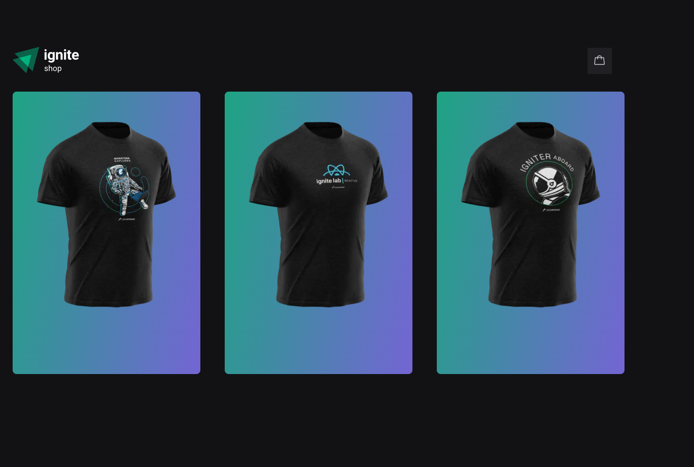
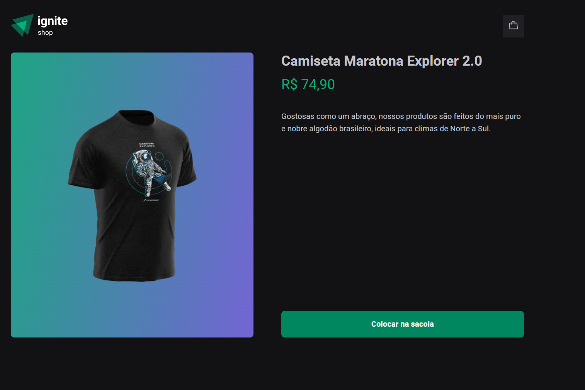
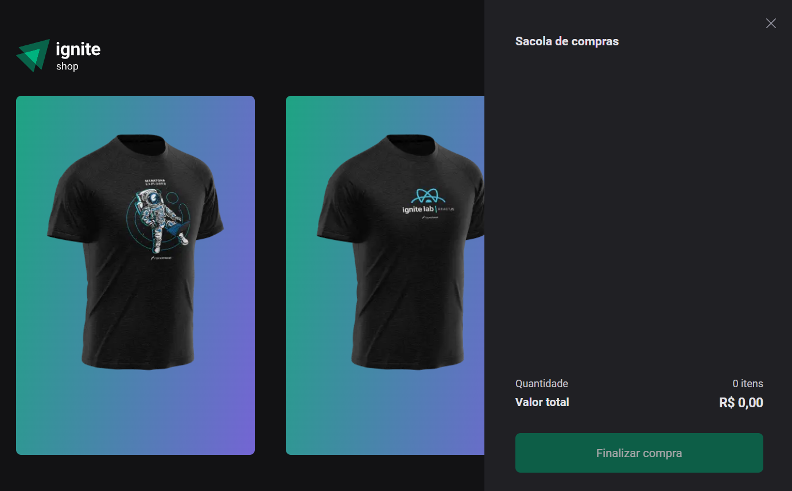
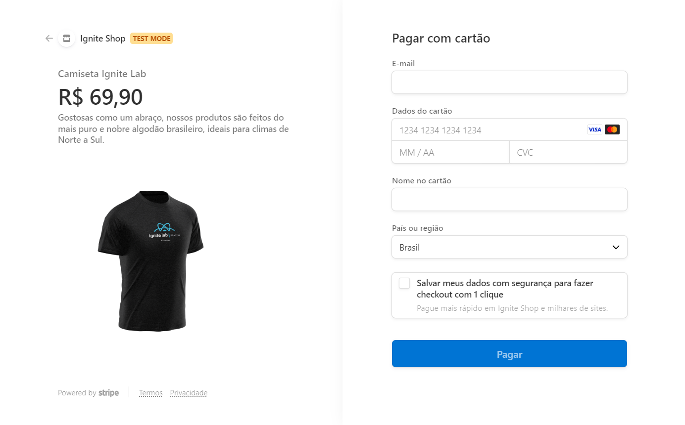
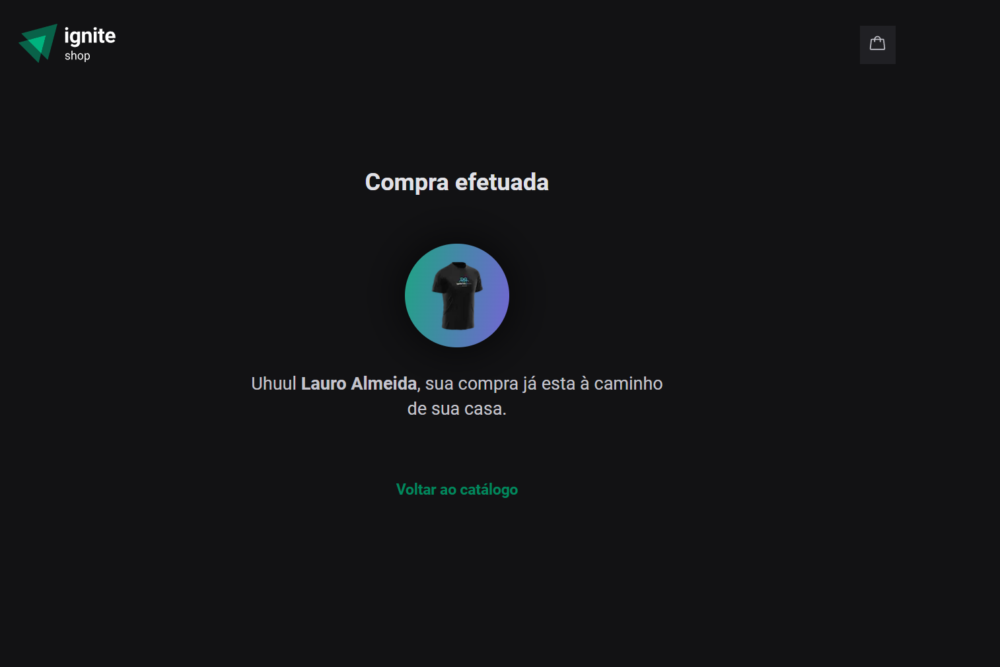

# Ignite Shop (desafio 04) - Bootcamp Ignite - RocketSeat
### Home

### Página do Produto

### Carrinho

### Checkout com Stripe

### Página de Sucesso

> Github Blog - Trilha 2022

Projeto desenvolvido como desafio para conclusão do módulo 4 do curso.

## 🔧 Tecnologias
- Next.JS
- TypeScript
- HTML
- CSS
- Git e Github
- Vite

## 📖 Bibliotecas
- Stripe
- Stitches
- Phosphor Icos
- axios

## ✉️ Contato
lauro.almeida@uniriotec.br